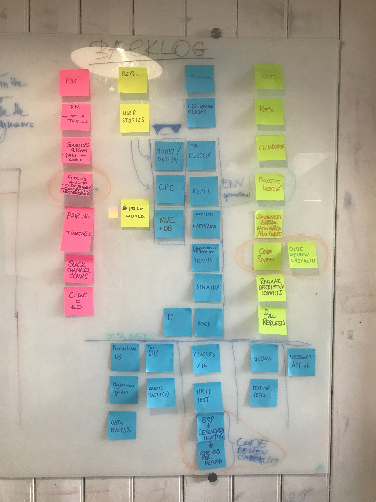

# TEAM SCORCHIO: MAKERS BnB

## USER STORIES

>* Any signed-up user can list a new space.  
>* Users can list multiple spaces.  
>* Users should be able to name their space, provide a short description of the space, and a price per night.  
>* Users should be able to offer a range of dates where their space is available.  
>* Any signed-up user can request to hire any space for one night, and this should be approved by the user that owns that space.  
>* Nights for which a space has already been booked should not be available for users to book that space.
>* Until a user has confirmed a booking request, that space can still be booked for that night.

## PROJECT BACKLOG

* Below is our project backlog board - it shows every element of our project
* Our key areas are:
  * Pink Post-its - Project Management
  * Yellow Post-its - User Requirements
  * Blue Post-its - Technical Requirements
  * Green Post-its - Git Management

